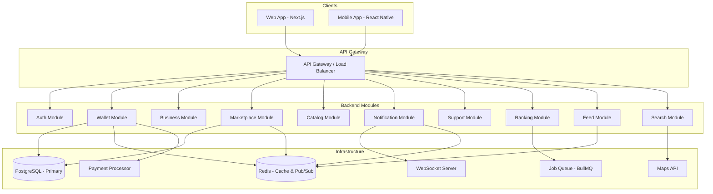

# Design Document: Coin Economy Platform

## Overview

La Coin Economy Platform es una aplicación web y móvil que implementa una economía de monedas virtuales bidivisas (Coins y Diamonds) para conectar negocios físicos con sus clientes. Los negocios recargan Coins mediante pago en COP y las donan a clientes como recompensa por compras físicas. Los usuarios acumulan Coins y pueden gastarlas en productos del catálogo o venderlas en el Marketplace a cambio de Diamonds. Los Diamonds son la divisa de compra en el mercado, recargable por usuarios y negocios.

### Principios de diseño

- **Separación estricta de billeteras**: Las Wallets de usuario y de negocio nunca se mezclan. Un Business_Owner tiene su Wallet personal de usuario y una Wallet separada por cada negocio que posee.
- **Atomicidad transaccional**: Toda operación financiera es atómica; no existen estados intermedios persistidos.
- **Inmutabilidad del ledger**: Las Transactions son registros inmutables que forman el libro contable de la plataforma.
- **Activación progresiva**: Funcionalidades como Rankings e Incentive_Fund se activan automáticamente al alcanzar 500 negocios activos.

---

## Architecture

La plataforma sigue una arquitectura de **monolito modular** con separación clara de dominios, desplegada en un **VPS de Hostinger** con Nginx como reverse proxy. El frontend web usa Next.js, la app móvil usa React Native, y el backend expone una API REST + WebSocket para notificaciones en tiempo real.

### Infraestructura en Hostinger VPS

| Componente | Tecnología | Instalación |
|-----------|-----------|-------------|
| Reverse Proxy | Nginx | Instalado en VPS |
| Backend | Node.js + Fastify | PM2 para gestión de procesos |
| Frontend Web | Next.js 14 | Build estático servido por Nginx o SSR con PM2 |
| Base de datos | PostgreSQL 16 | Instalado en VPS |
| Cache / Pub-Sub | Redis 7 | Instalado en VPS |
| Cola de trabajos | BullMQ (sobre Redis) | Instalado en VPS |
| SSL | Let's Encrypt (Certbot) | Configurado en Nginx |
| App Móvil | React Native + Expo | Distribuida via Expo Go / App Store / Play Store |

### Configuración Nginx (reverse proxy)

```nginx
server {
    listen 80;
    server_name tudominio.com;
    return 301 https://$host$request_uri;
}

server {
    listen 443 ssl;
    server_name tudominio.com;

    ssl_certificate /etc/letsencrypt/live/tudominio.com/fullchain.pem;
    ssl_certificate_key /etc/letsencrypt/live/tudominio.com/privkey.pem;

    # Frontend Next.js
    location / {
        proxy_pass http://localhost:3000;
        proxy_http_version 1.1;
        proxy_set_header Upgrade $http_upgrade;
        proxy_set_header Connection 'upgrade';
        proxy_set_header Host $host;
    }

    # Backend API
    location /api {
        proxy_pass http://localhost:4000;
        proxy_http_version 1.1;
        proxy_set_header Upgrade $http_upgrade;
        proxy_set_header Connection 'upgrade';
    }

    # WebSocket para notificaciones
    location /ws {
        proxy_pass http://localhost:4000;
        proxy_http_version 1.1;
        proxy_set_header Upgrade $http_upgrade;
        proxy_set_header Connection "Upgrade";
    }
}
```



### Stack tecnológico

| Capa | Tecnología |
|------|-----------|
| Frontend Web | Next.js 14 (App Router) + TypeScript |
| Frontend Mobile | React Native + Expo |
| Backend | Node.js + Fastify + TypeScript |
| Base de datos | PostgreSQL 16 (transacciones ACID) |
| Cache / Pub-Sub | Redis 7 |
| Cola de trabajos | BullMQ (sobre Redis) |
| Pagos | Stripe o PSE (Colombia) |
| Mapas | Google Maps API / Mapbox |
| WebSockets | Socket.IO |
| ORM | Prisma |

---

## Components and Interfaces

### Auth Module

Responsable del registro, autenticación y gestión de sesiones.

```typescript
interface AuthService {
  register(data: RegisterUserDTO): Promise<User>
  login(credentials: LoginDTO): Promise<AuthToken>
  verifyEmail(token: string): Promise<void>
  lockAccount(userId: string, durationMinutes: number): Promise<void>
  updateProfile(userId: string, data: UpdateProfileDTO): Promise<User>
}

interface RegisterUserDTO {
  email: string        // único
  username: string     // único
  password: string     // mínimo 8 caracteres
}

interface LoginDTO {
  email: string
  password: string
}
```

### Wallet Module

Núcleo financiero de la plataforma. Gestiona balances y ejecuta transferencias atómicas.

```typescript
interface WalletService {
  getBalance(walletId: string): Promise<WalletBalance>
  rechargeCoins(businessWalletId: string, paymentRef: string): Promise<Transaction>
  rechargeDiamonds(walletId: string, paymentRef: string): Promise<Transaction>
  donate(fromBusinessWalletId: string, toUserWalletId: string, amount: number): Promise<Transaction>
  transfer(params: TransferParams): Promise<Transaction>
  refundDiamonds(userWalletId: string): Promise<Transaction>
  getTransactionHistory(walletId: string, filters: TxFilters, page: Pagination): Promise<Page<Transaction>>
}

interface TransferParams {
  fromWalletId: string
  toWalletId: string
  coinAmount?: number
  diamondAmount?: number
  type: TransactionType
  metadata?: Record<string, unknown>
}
```

### Business Module

Gestión del ciclo de vida de negocios.

```typescript
interface BusinessService {
  create(ownerId: string, data: CreateBusinessDTO): Promise<Business>
  activate(businessId: string): Promise<Business>
  update(businessId: string, data: UpdateBusinessDTO): Promise<Business>
  getProfile(businessId: string): Promise<BusinessProfile>
  listByOwner(ownerId: string): Promise<Business[]>
}
```

### Marketplace Module

Gestión de ofertas de compra/venta de Coins.

```typescript
interface MarketplaceService {
  createOffer(userId: string, data: CreateOfferDTO): Promise<Offer>
  acceptOffer(buyerWalletId: string, offerId: string, accessCode?: string): Promise<Transaction>
  cancelOffer(userId: string, offerId: string): Promise<void>
  listOffers(filters: OfferFilters): Promise<Page<Offer>>
  getAccessCode(userId: string, offerId: string): Promise<string>
}

interface CreateOfferDTO {
  coinAmount: number       // > 0
  diamondPricePerCoin: number  // > 0
  visibility: 'publica' | 'privada'
}
```

### Notification Module

Entrega de notificaciones en tiempo real vía WebSocket y persistencia.

```typescript
interface NotificationService {
  send(userId: string, event: NotificationEvent): Promise<void>
  listNotifications(userId: string): Promise<Notification[]>
  markAsRead(userId: string, notificationId: string): Promise<void>
}

type NotificationEvent =
  | { type: 'DONATION_RECEIVED'; coins: number; businessName: string }
  | { type: 'MARKETPLACE_COMPLETED'; role: 'buyer' | 'seller'; coins: number; diamonds: number }
  | { type: 'PRODUCT_PURCHASED'; productName: string; buyerUsername: string }
  | { type: 'TICKET_STATUS_CHANGED'; ticketId: string; newStatus: TicketStatus }
```

### Support Module

Sistema de atención al cliente con chatbot, tickets y chat en vivo.

```typescript
interface SupportService {
  queryFAQ(question: string): Promise<FAQResult | null>
  createTicket(requesterId: string, data: CreateTicketDTO): Promise<Ticket>
  updateTicketStatus(agentId: string, ticketId: string, status: TicketStatus): Promise<Ticket>
  initiateChat(requesterId: string): Promise<SupportChat | Ticket>
  rateTicket(userId: string, ticketId: string, rating: 1|2|3|4|5): Promise<void>
  rateChat(userId: string, chatId: string, rating: 1|2|3|4|5): Promise<void>
}
```

### Ranking Module

Cálculo y distribución de rankings semanales/anuales.

```typescript
interface RankingService {
  computeWeeklyRankings(): Promise<void>   // ejecutado por cron cada 7 días
  distributeIncentiveFund(): Promise<void> // ejecutado tras computeWeeklyRankings si >= 500 negocios
  getRankings(type: RankingType, year?: number): Promise<RankingTable>
  isRankingActive(): Promise<boolean>      // true si >= 500 negocios activos
}

type RankingType =
  | 'USER_COINS_SOLD'
  | 'USER_COINS_BALANCE'
  | 'USER_COINS_REDEEMED'
  | 'BUSINESS_COINS_DONATED'
  | 'BUSINESS_COINS_PURCHASED'
  | 'BUSINESS_COINS_REDEEMED_ON'
```

---

## Data Models

### Entidades principales

```prisma
model User {
  id            String    @id @default(uuid())
  email         String    @unique
  username      String    @unique
  passwordHash  String
  name          String?
  profilePhoto  String?
  socialLinks   Json?     // { instagram?, facebook?, tiktok?, whatsapp?, website? }
  isLocked      Boolean   @default(false)
  lockedUntil   DateTime?
  failedLogins  Int       @default(0)
  emailVerified Boolean   @default(false)
  role          UserRole  @default(USER)
  createdAt     DateTime  @default(now())
  updatedAt     DateTime  @updatedAt

  wallet        Wallet?   @relation("UserWallet")
  businesses    Business[]
  offers        Offer[]
  follows       Follow[]  @relation("Follower")
  followedBy    Follow[]  @relation("Following")
  notifications Notification[]
  tickets       Ticket[]
}

enum UserRole {
  USER
  SUPPORT_AGENT
  ADMIN
}

model Business {
  id            String         @id @default(uuid())
  ownerId       String
  name          String
  description   String
  category      String
  address       String
  latitude      Float
  longitude     Float
  profilePhoto  String?
  coverPhoto    String?
  socialLinks   Json?
  status        BusinessStatus @default(PENDING)
  createdAt     DateTime       @default(now())
  updatedAt     DateTime       @updatedAt

  owner         User           @relation(fields: [ownerId], references: [id])
  wallet        Wallet?        @relation("BusinessWallet")
  products      Product[]
  follows       Follow[]       @relation("FollowedBusiness")
}

enum BusinessStatus {
  PENDING
  ACTIVE
}

model Wallet {
  id           String      @id @default(uuid())
  ownerType    WalletOwner // USER | BUSINESS
  userId       String?     @unique
  businessId   String?     @unique
  coinBalance  Decimal     @default(0) @db.Decimal(18, 4)
  diamondBalance Decimal   @default(0) @db.Decimal(18, 4)
  createdAt    DateTime    @default(now())
  updatedAt    DateTime    @updatedAt

  user         User?       @relation("UserWallet", fields: [userId], references: [id])
  business     Business?   @relation("BusinessWallet", fields: [businessId], references: [id])
  transactions Transaction[] @relation("FromWallet")
  received     Transaction[] @relation("ToWallet")
}

enum WalletOwner {
  USER
  BUSINESS
}

model Transaction {
  id              String          @id @default(uuid())
  type            TransactionType
  fromWalletId    String?
  toWalletId      String?
  coinAmount      Decimal?        @db.Decimal(18, 4)
  diamondAmount   Decimal?        @db.Decimal(18, 4)
  copAmount       Decimal?        @db.Decimal(18, 2)
  platformFee     Decimal?        @db.Decimal(18, 2)
  incentiveFund   Decimal?        @db.Decimal(18, 2)
  metadata        Json?
  createdAt       DateTime        @default(now())

  fromWallet      Wallet?         @relation("FromWallet", fields: [fromWalletId], references: [id])
  toWallet        Wallet?         @relation("ToWallet", fields: [toWalletId], references: [id])
}

enum TransactionType {
  COIN_RECHARGE
  DIAMOND_RECHARGE
  DONATION
  PRODUCT_PURCHASE
  MARKETPLACE_SALE
  MARKETPLACE_PURCHASE
  OFFER_CANCEL_RETURN
  DIAMOND_REFUND
  INCENTIVE_DISTRIBUTION
}

model Product {
  id          String   @id @default(uuid())
  businessId  String
  name        String
  description String
  imageUrl    String?
  coinPrice   Decimal  @db.Decimal(18, 4)
  isActive    Boolean  @default(true)
  createdAt   DateTime @default(now())
  updatedAt   DateTime @updatedAt

  business    Business @relation(fields: [businessId], references: [id])
}

model Offer {
  id                  String          @id @default(uuid())
  sellerId            String
  coinAmount          Decimal         @db.Decimal(18, 4)
  diamondPricePerCoin Decimal         @db.Decimal(18, 4)
  visibility          OfferVisibility @default(PUBLICA)
  accessCode          String?         @unique
  status              OfferStatus     @default(ACTIVE)
  createdAt           DateTime        @default(now())
  updatedAt           DateTime        @updatedAt

  seller              User            @relation(fields: [sellerId], references: [id])
}

enum OfferVisibility {
  PUBLICA
  PRIVADA
}

enum OfferStatus {
  ACTIVE
  COMPLETED
  CANCELLED
}

model Follow {
  id             String    @id @default(uuid())
  followerId     String
  followedUserId String?
  followedBizId  String?
  createdAt      DateTime  @default(now())

  follower       User      @relation("Follower", fields: [followerId], references: [id])
  followedUser   User?     @relation("Following", fields: [followedUserId], references: [id])
  followedBiz    Business? @relation("FollowedBusiness", fields: [followedBizId], references: [id])

  @@unique([followerId, followedUserId])
  @@unique([followerId, followedBizId])
}

model Notification {
  id        String   @id @default(uuid())
  userId    String
  type      String
  payload   Json
  isRead    Boolean  @default(false)
  createdAt DateTime @default(now())

  user      User     @relation(fields: [userId], references: [id])
}

model Ticket {
  id          String       @id @default(uuid())
  requesterId String
  description String
  status      TicketStatus @default(ABIERTO)
  rating      Int?
  createdAt   DateTime     @default(now())
  updatedAt   DateTime     @updatedAt

  requester   User         @relation(fields: [requesterId], references: [id])
}

enum TicketStatus {
  ABIERTO
  EN_PROGRESO
  RESUELTO
  CERRADO
}

model IncentiveFund {
  id           String   @id @default(uuid())
  coinBalance  Decimal  @default(0) @db.Decimal(18, 4)
  updatedAt    DateTime @updatedAt
}

model RankingSnapshot {
  id         String      @id @default(uuid())
  type       String      // RankingType enum value
  year       Int
  weekNumber Int
  entries    Json        // [{ position, entityId, entityType, metricValue }]
  createdAt  DateTime    @default(now())
}
```

### Reglas de negocio críticas en el modelo

| Regla | Implementación |
|-------|---------------|
| Máx. 3 negocios por usuario | Constraint en BusinessService antes de INSERT |
| Wallet usuario ≠ Wallet negocio | `ownerType` + constraints únicos en `userId`/`businessId` |
| No auto-donaciones | Validación: `business.ownerId !== recipientUserId` |
| Solo Users crean Offers | Validación de rol en MarketplaceService |
| Reembolso solo en rango [200, 500] | Validación de balance antes de procesar |
| Coins = floor(35000 / 150) = 233 | Constante `COIN_RECHARGE_AMOUNT = 233` |
| Diamonds = floor(17500 / 250) = 70 | Constante `DIAMOND_RECHARGE_AMOUNT = 70` |

---

## Correctness Properties

*A property is a characteristic or behavior that should hold true across all valid executions of a system — essentially, a formal statement about what the system should do. Properties serve as the bridge between human-readable specifications and machine-verifiable correctness guarantees.*


### Property 1: Unicidad de registro

*For any* dos intentos de registro que compartan el mismo email o username, el segundo intento SHALL ser rechazado y no se SHALL crear ninguna cuenta adicional.

**Validates: Requirements 1.1, 1.3**

---

### Property 2: Wallet inicial en cero

*For any* registro de usuario o creación de negocio exitosos, la Wallet resultante SHALL tener exactamente 0 Coins y 0 Diamonds en el momento de su creación.

**Validates: Requirements 1.2, 2.2**

---

### Property 3: Límite de 3 negocios por usuario

*For any* usuario que ya posee 3 negocios activos, cualquier intento de crear un negocio adicional SHALL ser rechazado con un error descriptivo.

**Validates: Requirements 2.6, 2.8**

---

### Property 4: Cálculo correcto de recarga de Coins

*For any* recarga de Coins completada con pago de $50.000 COP, el sistema SHALL acreditar exactamente 233 Coins a la Business Wallet, registrar Platform_Fee de $12.500 COP, y registrar Incentive_Fund de $2.500 COP.

**Validates: Requirements 3.2, 3.3, 3.4**

---

### Property 5: Cálculo correcto de recarga de Diamonds

*For any* recarga de Diamonds completada con pago de $25.000 COP, el sistema SHALL acreditar exactamente 70 Diamonds a la Wallet destino, registrar Platform_Fee de $6.250 COP, y registrar Incentive_Fund de $1.250 COP.

**Validates: Requirements 6.2, 6.3, 6.4**

---

### Property 6: Routing correcto de recarga de Diamonds

*For any* recarga de Diamonds, si el solicitante es un User SHALL acreditarse a su User Wallet; si es un Business_Owner SHALL acreditarse a la Business Wallet, nunca a la User Wallet personal del Business_Owner.

**Validates: Requirements 6.6, 6.7**

---

### Property 7: Conservación de balance en donaciones

*For any* donación válida de `n` Coins desde una Business Wallet a una User Wallet, la suma de ambos balances de Coins SHALL permanecer igual antes y después de la operación (balance_business_antes + balance_user_antes = balance_business_después + balance_user_después).

**Validates: Requirements 4.1, 4.2**

---

### Property 8: Invariante de balance no negativo

*For any* operación financiera (donación, compra, marketplace, reembolso), si el monto solicitado excede el balance disponible en la Wallet origen, la operación SHALL ser rechazada y ningún balance SHALL ser modificado.

**Validates: Requirements 4.3, 8.3, 9.2, 9.8, 9.9**

---

### Property 9: Prohibición de auto-donaciones

*For any* intento de donación donde el `ownerId` del Business coincide con el `userId` del destinatario, la operación SHALL ser rechazada con un error descriptivo.

**Validates: Requirements 4.7**

---

### Property 10: Restricción de recarga de Coins a Business_Owners

*For any* usuario sin rol Business_Owner que intente realizar una recarga de Coins, la operación SHALL ser rechazada.

**Validates: Requirements 3.8, 5.5**

---

### Property 11: Conservación de balance en compra de productos

*For any* compra válida de un producto con precio `p` Coins, el balance de Coins del User SHALL disminuir exactamente en `p`.

**Validates: Requirements 8.1, 8.2**

---

### Property 12: Productos inactivos no comprables

*For any* intento de compra de un producto con `isActive = false`, la operación SHALL ser rechazada con un error descriptivo.

**Validates: Requirements 8.4**

---

### Property 13: Restricción de creación de Offers a Users

*For any* Business_Owner que intente crear una Offer en el Marketplace, la operación SHALL ser rechazada con un error descriptivo.

**Validates: Requirements 9.3**

---

### Property 14: Reserva de Coins al crear Offer

*For any* creación válida de Offer con `coinAmount = n`, el balance de Coins del User SHALL disminuir exactamente en `n` en el momento de publicación.

**Validates: Requirements 9.1**

---

### Property 15: Conservación en transacción de Marketplace

*For any* aceptación de Offer con `coinAmount = c` y `diamondPricePerCoin = d`, el comprador SHALL recibir exactamente `c` Coins, el vendedor SHALL recibir exactamente `c * d` Diamonds, y el comprador SHALL perder exactamente `c * d` Diamonds.

**Validates: Requirements 9.5, 9.6, 9.7**

---

### Property 16: Round-trip de cancelación de Offer

*For any* Offer activa cancelada por su creador, el balance de Coins del vendedor SHALL ser restaurado al valor que tenía antes de crear la Offer.

**Validates: Requirements 9.10, 9.11**

---

### Property 17: Unicidad de Access_Code para Offers privadas

*For any* conjunto de Offers privadas creadas en la plataforma, todos los Access_Codes SHALL ser distintos entre sí.

**Validates: Requirements 9.14**

---

### Property 18: Control de acceso a Offers privadas

*For any* Offer con `visibility = PRIVADA`, un intento de aceptación sin el Access_Code correcto SHALL ser rechazado; con el Access_Code correcto SHALL proceder bajo las mismas condiciones que una Offer pública.

**Validates: Requirements 9.17, 9.18**

---

### Property 19: Atomicidad transaccional

*For any* operación multi-paso que falle en cualquier paso intermedio, ningún cambio de balance SHALL persistir (rollback completo).

**Validates: Requirements 10.1, 10.3**

---

### Property 20: Conservación global de Coins

*For any* estado de la plataforma, la suma de todos los balances de Coins en todas las Wallets más los Coins reservados en Offers activas más los Coins en el Incentive_Fund SHALL ser igual a la suma de todos los Coin Recharges completados menos la suma de todos los Coins gastados en compras de productos.

**Validates: Requirements 10.4**

---

### Property 21: Conservación global de Diamonds

*For any* estado de la plataforma, la suma de todos los balances de Diamonds en todas las Wallets SHALL ser igual a la suma de todos los Diamond Recharges completados menos la suma de todos los Diamonds reembolsados.

**Validates: Requirements 10.5**

---

### Property 22: Rango válido para reembolso de Diamonds

*For any* balance de Diamonds fuera del rango [200, 500], el intento de Diamond_Refund SHALL ser rechazado; para cualquier balance dentro del rango [200, 500], el reembolso SHALL ser permitido.

**Validates: Requirements 12.2, 12.3, 12.4**

---

### Property 23: Cálculo correcto de reembolso de Diamonds

*For any* Diamond_Refund de `n` Diamonds completado, el monto en COP SHALL ser exactamente `n * 250`.

**Validates: Requirements 12.5, 12.6**

---

### Property 24: Secuencia válida de estados de Ticket

*For any* Ticket, un intento de transición de estado que no siga la secuencia `ABIERTO → EN_PROGRESO → RESUELTO → CERRADO` SHALL ser rechazado.

**Validates: Requirements 13.4**

---

### Property 25: Privacidad en resultados de búsqueda

*For any* resultado de búsqueda de usuarios o negocios, la respuesta SHALL NOT contener balance de Coins, balance de Diamonds, ni historial de Transactions.

**Validates: Requirements 14.3, 1.9**

---

### Property 26: Solo negocios activos en búsqueda

*For any* búsqueda de negocios, todos los resultados retornados SHALL tener `status = ACTIVE`.

**Validates: Requirements 14.8**

---

### Property 27: Rankings ocultos con menos de 500 negocios activos

*For any* estado de la plataforma con menos de 500 negocios activos, cualquier consulta de Rankings SHALL retornar una respuesta vacía o indicar que los Rankings no están disponibles.

**Validates: Requirements 15.3, 16.3**

---

### Property 28: Contribución al Incentive_Fund por recarga de Coins

*For any* recarga de Coins completada, el Incentive_Fund SHALL incrementarse en exactamente `floor(2500 / 150) = 16` Coins.

**Validates: Requirements 16.1**

---

### Property 29: Contribución al Incentive_Fund por recarga de Diamonds

*For any* recarga de Diamonds completada, el Incentive_Fund SHALL incrementarse en exactamente `floor(1250 / 150) = 8` Coins.

**Validates: Requirements 16.2**

---

### Property 30: Round-trip de Follow/Unfollow en Feed

*For any* relación de Follow entre un User A y una cuenta B, las publicaciones nuevas de B SHALL aparecer en el Feed de A; tras un Unfollow, las publicaciones nuevas de B SHALL NOT aparecer en el Feed de A.

**Validates: Requirements 18.1, 18.2**

---

### Property 31: Idempotencia negativa de Follow

*For any* relación de Follow ya existente entre User A y cuenta B, un segundo intento de Follow SHALL ser rechazado; para cualquier relación de Follow inexistente, un intento de Unfollow SHALL ser rechazado.

**Validates: Requirements 18.7, 18.8**

---

## Error Handling

### Estrategia general

Todos los errores retornan una respuesta estructurada:

```typescript
interface ErrorResponse {
  code: string       // e.g. "INSUFFICIENT_BALANCE", "SELF_DONATION_NOT_ALLOWED"
  message: string    // descripción legible
  details?: unknown  // contexto adicional opcional
}
```

### Catálogo de errores de dominio

| Código | Módulo | Descripción |
|--------|--------|-------------|
| `DUPLICATE_EMAIL` | Auth | Email ya registrado |
| `DUPLICATE_USERNAME` | Auth | Username ya registrado |
| `ACCOUNT_LOCKED` | Auth | Cuenta bloqueada temporalmente |
| `INVALID_CREDENTIALS` | Auth | Credenciales incorrectas |
| `BUSINESS_LIMIT_REACHED` | Business | Usuario ya tiene 3 negocios |
| `BUSINESS_PENDING` | Business | Negocio en estado pending |
| `INSUFFICIENT_BALANCE` | Wallet | Balance insuficiente para la operación |
| `SELF_DONATION_NOT_ALLOWED` | Wallet | Auto-donación no permitida |
| `COIN_RECHARGE_FORBIDDEN` | Wallet | Usuario sin rol Business_Owner |
| `PAYMENT_FAILED` | Wallet | Fallo en procesador de pagos |
| `PRODUCT_INACTIVE` | Catalog | Producto inactivo |
| `INVALID_PRODUCT_PRICE` | Catalog | Precio de producto <= 0 |
| `OFFER_CREATION_FORBIDDEN` | Marketplace | Business_Owner no puede crear Offers |
| `INVALID_ACCESS_CODE` | Marketplace | Access_Code incorrecto para Offer privada |
| `OFFER_NOT_ACTIVE` | Marketplace | Offer ya completada o cancelada |
| `DIAMOND_REFUND_BELOW_MIN` | Wallet | Balance < 200 Diamonds |
| `DIAMOND_REFUND_ABOVE_MAX` | Wallet | Balance > 500 Diamonds |
| `DIAMOND_REFUND_FORBIDDEN` | Wallet | Business_Owner no puede hacer reembolso |
| `INVALID_TICKET_TRANSITION` | Support | Transición de estado inválida |
| `FOLLOW_ALREADY_EXISTS` | Follow | Relación de Follow ya existe |
| `FOLLOW_NOT_FOUND` | Follow | Relación de Follow no existe |

### Manejo de fallos en pagos

Los pagos externos (recargas) usan un patrón de **idempotency key** para evitar doble cobro:

```
1. Generar idempotency_key único antes de llamar al procesador
2. Registrar intento de pago en DB con estado PENDING
3. Llamar al procesador de pagos
4. Si éxito: actualizar estado a COMPLETED, ejecutar lógica de negocio en transacción DB
5. Si fallo: actualizar estado a FAILED, no modificar wallets
6. Si timeout: consultar estado con idempotency_key antes de reintentar
```

### Manejo de fallos en distribución del Incentive_Fund

Según Requirement 16.8, si falla la transferencia a un destinatario específico:
- Se hace rollback solo de esa transferencia individual
- El fondo restante se preserva
- Se registra un log de error con el destinatario fallido
- Las demás transferencias del ciclo continúan

---

## Testing Strategy

### Enfoque dual: Unit Tests + Property-Based Tests

La estrategia combina tests de ejemplo para comportamientos específicos y tests basados en propiedades para verificar invariantes universales.

### Librería de Property-Based Testing

Se utilizará **fast-check** (TypeScript/JavaScript) para todos los property-based tests.

```bash
npm install --save-dev fast-check
```

Cada property test se ejecuta con mínimo **100 iteraciones**.

### Configuración de tags

Cada property test debe incluir un comentario de referencia:

```typescript
// Feature: coin-economy-platform, Property N: <property_text>
```

### Cobertura por módulo

#### Auth Module
- Property tests: unicidad de registro (Property 1), wallet inicial en cero (Property 2)
- Unit tests: bloqueo tras 5 intentos fallidos, verificación de email, actualización de perfil

#### Wallet Module
- Property tests: conservación en donaciones (Property 7), balance no negativo (Property 8), atomicidad (Property 19), conservación global de Coins (Property 20), conservación global de Diamonds (Property 21)
- Unit tests: cálculo de recargas, routing de Diamond recharge, restricciones de rol

#### Business Module
- Property tests: límite de 3 negocios (Property 3), wallet inicial en cero (Property 2)
- Unit tests: transición de estado PENDING → ACTIVE, validación de campos

#### Marketplace Module
- Property tests: reserva de Coins al crear Offer (Property 14), conservación en transacción (Property 15), round-trip de cancelación (Property 16), unicidad de Access_Code (Property 17), control de acceso privado (Property 18)
- Unit tests: ordenamiento de Offers por precio, filtros de búsqueda

#### Recharge Module
- Property tests: cálculo de Coins (Property 4), cálculo de Diamonds (Property 5), routing de Diamonds (Property 6), contribución al Incentive_Fund (Properties 28, 29)
- Unit tests: fallo de pago no modifica balance, idempotency key

#### Diamond Refund Module
- Property tests: rango válido [200, 500] (Property 22), cálculo de reembolso (Property 23)
- Unit tests: restricción a Users, fallo de disbursement

#### Support Module
- Property tests: secuencia de estados de Ticket (Property 24)
- Unit tests: chatbot FAQ lookup, escalación automática a Ticket, ratings

#### Search Module
- Property tests: privacidad en resultados (Property 25), solo negocios activos (Property 26)
- Integration tests: búsqueda por nombre, categoría, username; resultados vacíos

#### Ranking Module
- Property tests: Rankings ocultos con < 500 negocios (Property 27)
- Integration tests: cálculo semanal, rankings anuales, distribución del Incentive_Fund

#### Follow/Feed Module
- Property tests: round-trip Follow/Unfollow en Feed (Property 30), idempotencia negativa (Property 31)
- Unit tests: contadores de followers, feed vacío sin follows

### Tests de integración

Los siguientes escenarios requieren tests de integración (no PBT):

- Entrega de notificaciones en tiempo real (< 10 segundos) — Requirements 11.1-11.3, 13.5
- Contadores en tiempo real en página principal (< 5 segundos) — Requirement 17.5
- Integración con procesador de pagos (Stripe/PSE)
- Integración con Maps API para geolocalización
- WebSocket para Support_Chat en vivo
- Distribución del Incentive_Fund end-to-end

### Ejemplo de property test

```typescript
import fc from 'fast-check'
import { WalletService } from '../wallet/wallet.service'

// Feature: coin-economy-platform, Property 7: Conservación de balance en donaciones
test('donation preserves total coin balance', async () => {
  await fc.assert(
    fc.asyncProperty(
      fc.integer({ min: 1, max: 10000 }),  // donation amount
      fc.integer({ min: 0, max: 10000 }),  // user initial balance
      async (donationAmount, userInitialBalance) => {
        const businessBalance = donationAmount + 100 // ensure sufficient balance
        const { businessWallet, userWallet } = await setupWallets(businessBalance, userInitialBalance)

        await walletService.donate(businessWallet.id, userWallet.id, donationAmount)

        const updatedBusiness = await walletService.getBalance(businessWallet.id)
        const updatedUser = await walletService.getBalance(userWallet.id)

        const totalBefore = businessBalance + userInitialBalance
        const totalAfter = Number(updatedBusiness.coinBalance) + Number(updatedUser.coinBalance)

        expect(totalAfter).toBe(totalBefore)
      }
    ),
    { numRuns: 100 }
  )
})
```
